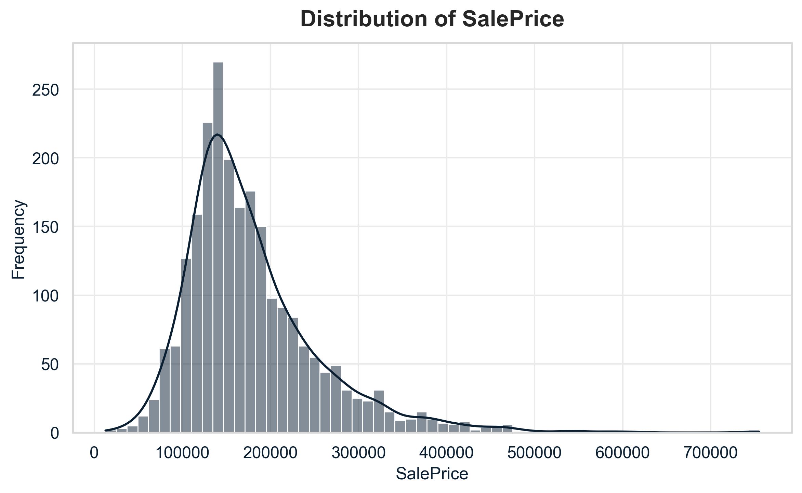
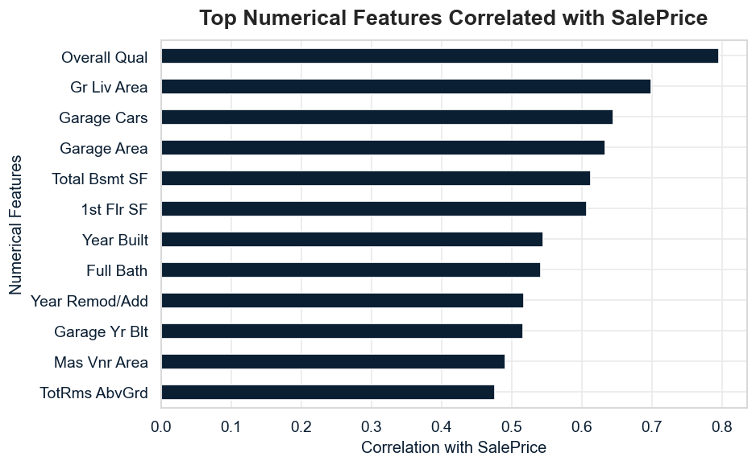
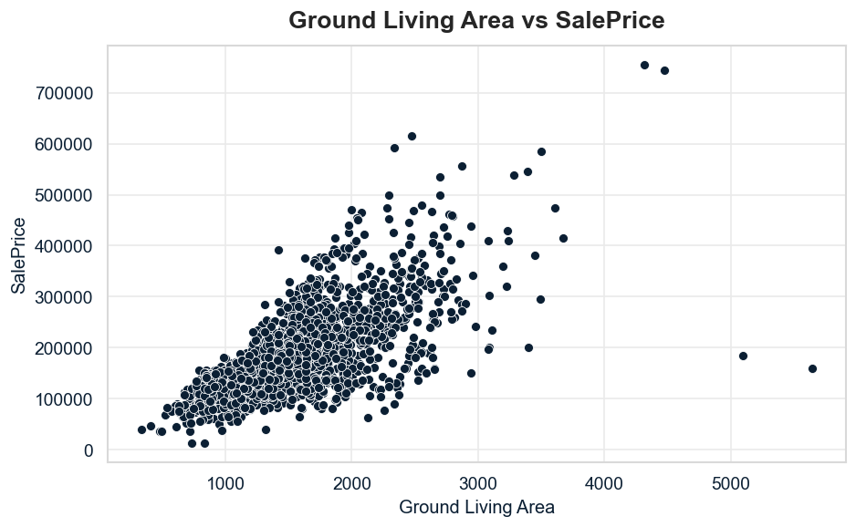
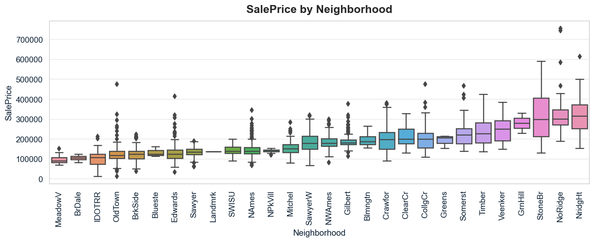
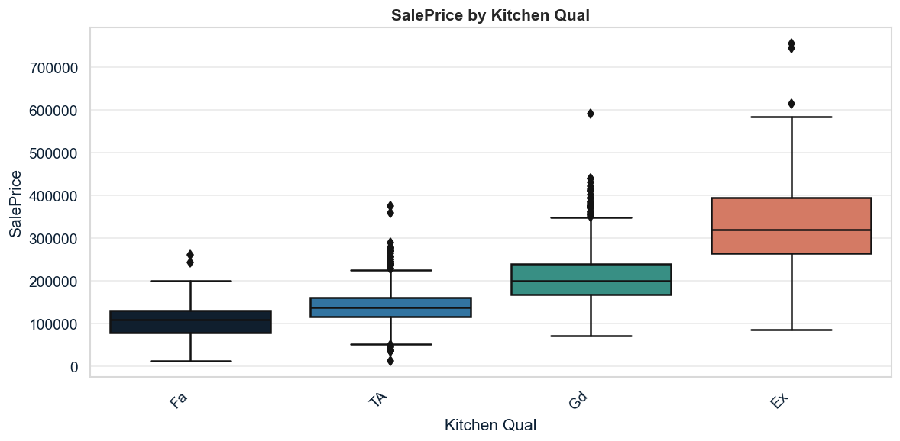
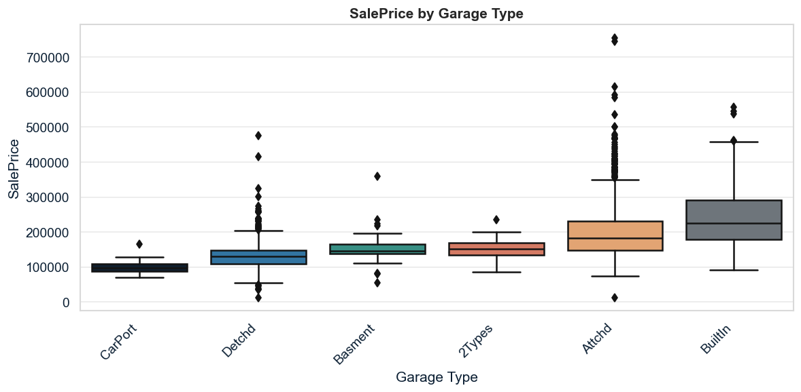
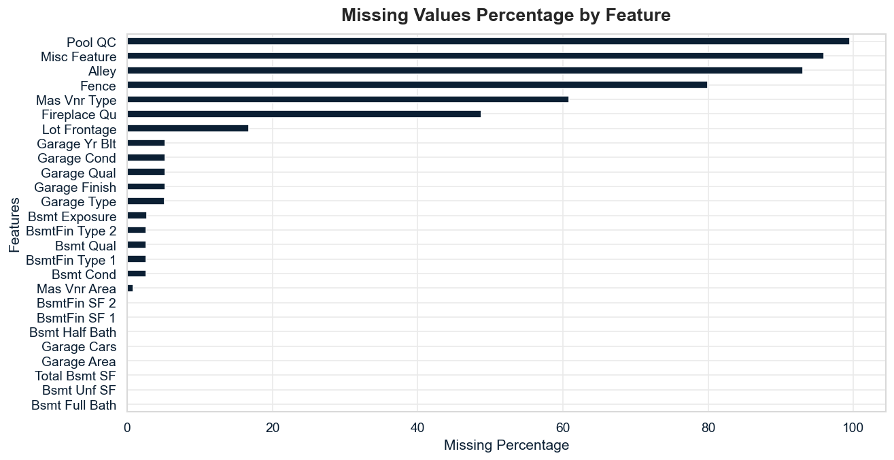
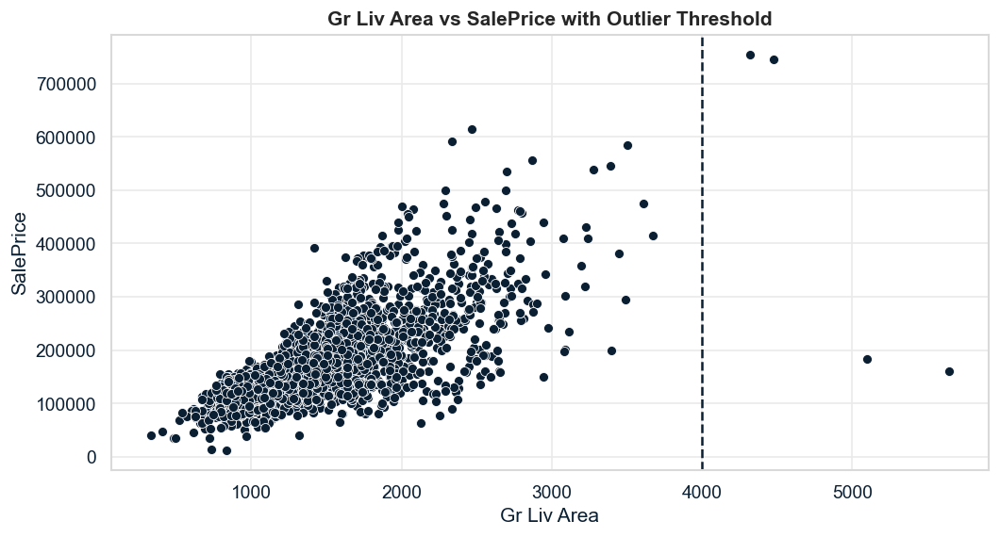

# Ames Housing Price Prediction

  

  A machine learning regression project focused on predicting house sale prices using the Ames Housing dataset.

---

## 1. Project Description

This project is my implementation of a machine learning workflow for predicting house sale prices using the Ames Housing dataset.

The idea behind the project was not only to train a regression model, but also to understand the main factors that influence residential property prices. For that reason, I started with a detailed exploratory data analysis before moving into feature engineering, preprocessing, model comparison and final evaluation.

The target variable is **SalePrice**, and the model uses property-related features such as overall quality, living area, basement size, garage capacity, neighborhood, house age, remodeling information and other structural characteristics.

I organized the work into two main notebooks. The first notebook focuses on EDA, where I analyzed the target distribution, missing values, outliers and the relationship between the main features and sale price. The second notebook focuses on modelling, where I built a preprocessing pipeline, created new features, compared different regression models and tuned the best-performing one.

After comparing multiple models with cross-validation, Gradient Boosting was selected as the final model. It provided the best balance between predictive performance and business interpretation, since its most important features were aligned with what would be expected in the real estate market: overall quality, total property size, number of bathrooms, house age, garage capacity and quality-related variables.

The final model, metrics and test predictions were saved as artifacts so the results can be reviewed and the project can be extended later.

---

## 2. Project Stack

This project was developed using Python in Jupyter Notebook, with Visual Studio Code as the development environment and Git/GitHub for version control.

The main libraries used were:

- **Pandas and NumPy** for data manipulation and numerical operations.
- **Matplotlib and Seaborn** for exploratory data visualization.
- **Scikit-Learn** for preprocessing, pipelines, cross-validation, model training, hyperparameter tuning and evaluation.
- **Joblib** for saving the final trained model.

The regression models tested included Ridge Regression, ElasticNet, Random Forest, Extra Trees and Gradient Boosting Regressor.

---

## 3. Business Problem and Project Objective

### 3.1 What is the business problem?

In the real estate market, estimating the correct sale price of a property is a challenging task. A house price depends on many factors, such as location, overall quality, living area, age, garage capacity, basement features, number of bathrooms and other structural characteristics.

Incorrect pricing can create problems for different stakeholders. Sellers may lose money if a property is undervalued, while overpriced houses may stay on the market for longer. Buyers also need reliable price references to avoid overpaying, and real estate professionals can benefit from data-driven tools to support pricing decisions.

The business problem of this project is: **how can we estimate the final sale price of a house based on its characteristics?**

### 3.2 What is the context?

House pricing is usually influenced by a combination of physical, qualitative and location-related attributes. In this project, the Ames Housing dataset was used to analyze historical house sales and understand which features are most associated with **SalePrice**.

Some important factors considered in this context include:

- **Property quality:** overall material and finish quality.
- **Property size:** total square footage, living area and basement area.
- **Location:** neighborhood and surrounding characteristics.
- **Age and renovation:** year built and remodeling information.
- **Property functionality:** garage capacity, bathrooms, fireplace, basement and other amenities.

By using historical data, machine learning can help identify patterns that are not always obvious through manual analysis. The goal is not to replace a professional appraisal, but to create a model that can support better pricing analysis and provide a data-driven estimate of house value.

### 3.3 Which are the project objectives?

The main objectives of this project are:

- Understand the main factors associated with house sale prices.
- Perform exploratory data analysis to identify patterns, missing values, outliers and feature engineering opportunities.
- Build a supervised machine learning regression model to predict **SalePrice**.
- Compare different regression algorithms using cross-validation.
- Select and tune the best-performing model.
- Evaluate the final model on an untouched test set.
- Interpret the model results through feature importance.
- Save the final model, metrics and predictions as project artifacts.

### 3.4 Which are the project benefits?

This project can provide several benefits, such as:

- More consistent house price estimation.
- Better understanding of the main price drivers in the dataset.
- Support for buyers, sellers and real estate professionals during pricing analysis.
- Reduced reliance only on intuition or manual comparisons.
- A reproducible machine learning workflow that can be improved or deployed in the future.

As a result, the project creates a data-driven approach to estimate house prices and understand which property characteristics have the strongest influence on the final sale value.

### 3.5 Conclusion

When using the final model, the main objective is to generate a numerical price estimate for each property based on its characteristics.

For this type of problem, predicting a continuous value is more useful than assigning houses into broad price categories, because it gives a more practical estimate of the expected sale price. This can help support pricing decisions, compare similar properties and identify whether a house may be underpriced or overpriced compared to the patterns learned from historical data.

However, the model should be used as a decision-support tool, not as a definitive appraisal system. Real estate prices can also be affected by external factors that are not present in the dataset, such as market demand, interest rates, local economic conditions, school quality, crime rates and negotiation dynamics.

Even with these limitations, the project demonstrates how exploratory data analysis, feature engineering and machine learning can be combined to build a strong and interpretable regression workflow for house price prediction.

---

## 4. Solution Pipeline

The project followed a structured machine learning workflow inspired by the CRISP-DM framework.

The main steps were:

1. Define the business problem and project objective.
2. Load the Ames Housing dataset and get a general overview of the data.
3. Split the dataset into training and test sets before deeper analysis, reducing the risk of data leakage.
4. Perform exploratory data analysis on the training data.
5. Analyze missing values, outliers, numerical features and categorical variables.
6. Create new features based on property characteristics, such as house age, remodeling status, total property size and total number of bathrooms.
7. Build preprocessing pipelines for numerical and categorical variables.
8. Train and compare multiple regression models using cross-validation.
9. Tune the best-performing model.
10. Evaluate the final selected model on the untouched test set.
11. Interpret the model results using feature importance.
12. Save the final model, evaluation metrics and test predictions as project artifacts.

Each step is explained in detail inside the notebooks, including the reasoning behind the main decisions made during the project.

---

## 5. Dataset Overview

The dataset used in this project is the Ames Housing dataset, which contains detailed information about residential properties sold in Ames, Iowa.

The original dataset has **2,930 rows and 82 columns**. The target variable is **SalePrice**, which represents the final sale price of each house. The remaining variables describe different property characteristics, such as lot area, living area, overall quality, year built, garage information, basement features, neighborhood and other structural attributes.

In the initial data inspection, no duplicated rows were found and the target variable did not contain missing values. However, several explanatory variables had missing values. In this dataset, some of these missing values do not necessarily mean data errors; in many cases, they indicate the absence of a specific property feature, such as no garage, no basement, no fireplace or no masonry veneer.

The dataset contains both numerical and categorical variables, which makes preprocessing an important part of the project. Numerical features require imputation and scaling, while categorical features require missing value treatment and encoding before being used by machine learning models.

<table>
  <tr>
    <th>Item</th>
    <th>Description</th>
  </tr>
  <tr>
    <td>Dataset</td>
    <td>Ames Housing</td>
  </tr>
  <tr>
    <td>Rows</td>
    <td>2,930</td>
  </tr>
  <tr>
    <td>Columns</td>
    <td>82</td>
  </tr>
  <tr>
    <td>Target variable</td>
    <td>SalePrice</td>
  </tr>
  <tr>
    <td>Problem type</td>
    <td>Supervised regression</td>
  </tr>
  <tr>
    <td>Numerical columns</td>
    <td>39, including the target variable</td>
  </tr>
  <tr>
    <td>Categorical columns</td>
    <td>43</td>
  </tr>
  <tr>
    <td>Duplicated rows</td>
    <td>0</td>
  </tr>
  <tr>
    <td>Missing values in target</td>
    <td>0</td>
  </tr>
</table>

---

## 6. Exploratory Data Analysis and Business Insights

The exploratory data analysis was performed only on the training data to avoid data leakage.  
The main goal of this step was to understand the behavior of the target variable, identify relevant relationships between features and **SalePrice**, analyze missing values and detect potential outliers before the modelling stage.

### 6.1 Target Variable Analysis

The target variable **SalePrice** is right-skewed, meaning that most houses are concentrated in lower and mid-price ranges, while a smaller number of properties have much higher sale prices.

This behavior is common in real estate data, where expensive properties can pull the average price upward. Because of this skewness, a log transformation was considered as a possible strategy during the modeling stage.

  

**Main insight:**  
The distribution shows that house prices are not evenly distributed. Most properties are concentrated below the higher price ranges, while a few expensive houses create a long right tail. This means that evaluation metrics should be interpreted carefully, since high-value properties can have a stronger impact on model errors.

### 6.2 Numerical Features Analysis

The numerical analysis showed that some features have a strong relationship with SalePrice.

The most relevant numerical variables were related to property quality, size, garage capacity, basement area, number of bathrooms and construction year. Among them, Overall Qual and Gr Liv Area stood out as two of the strongest price drivers.

  

  

**Main insights:**

- Overall Qual has one of the strongest relationships with SalePrice, showing that the general quality of the property is a major factor in pricing.
- Gr Liv Area is also strongly related to price, suggesting that larger living areas tend to increase property value.
- Garage-related variables, basement area and bathroom-related features also showed relevant influence.
- Some numerical variables are highly correlated with each other, which is important to consider during modelling.

### 6.3 Categorical Features Analysis

Categorical variables also showed important patterns in relation to house prices. Features related to location, material quality, kitchen quality, basement quality and garage type created clear differences in sale prices across categories.

  

  

  

**Main insights:**

- Neighborhood appears to be strongly related to SalePrice, confirming that location plays an important role in real estate pricing.
- Quality-related categorical features such as Kitchen Qual, Exter Qual and Bsmt Qual showed clear price differences across categories.
- Garage-related categories also seem relevant, especially when comparing houses with attached garages to houses without garage information.
- These variables need to be properly encoded before being used in machine learning models.

### 6.4 Missing Values Analysis

The dataset contains several missing values, but not all of them represent data quality problems.

In many Ames Housing features, missing values indicate that the property does not have a specific characteristic. For example, missing values in garage, basement, fireplace, pool or fence-related variables may simply mean that the house does not have that feature.

  

**Main insights:**

- Missing values in features such as Fireplace Qu, garage-related columns and basement-related columns likely represent absence of those structures.
- These values should not be removed automatically.
- Some numerical missing values can be filled with zero when they represent absence, while others may require statistical imputation.
- Understanding the meaning of missing values was important for building a more consistent preprocessing strategy.

### 6.5 Outliers Analysis

Outliers were identified in important numerical variables such as SalePrice, Gr Liv Area, Lot Area, Total Bsmt SF and Garage Area.

However, not every outlier should be removed. In real estate data, expensive houses, large lots or properties with unusual characteristics may still represent valid observations.

  

**Main insights:**

- High values in SalePrice may represent legitimate expensive properties.
- Some extreme values in Gr Liv Area may have a strong impact on regression models.
- Outliers were analyzed carefully instead of being removed automatically.
- Final outlier treatment decisions were made later during the modelling notebook, using only the training set.

### 6.6 Main Business Insights

Based on the exploratory analysis, the most important business insights were:

- Property quality is one of the strongest drivers of sale price.
- Larger houses tend to be more expensive, especially when considering above-ground living area and total property size.
- Location has a strong impact on price, as different neighborhoods show clear differences in sale value.
- Garage capacity, basement area, number of bathrooms and construction year are relevant features for price estimation.
- Missing values can contain useful business information, especially when they indicate the absence of a feature.
- Outliers should be handled carefully because some extreme properties may be valid and meaningful in the real estate market.

These insights guided the next steps of the project, especially feature engineering, preprocessing and model selection.

---

## 7. Machine Learning Modeling

After completing the exploratory data analysis, the next step was to build a machine learning pipeline capable of predicting house sale prices.

The modeling stage followed the same logic defined during the EDA: avoid data leakage, preserve the meaning of missing values, apply business-oriented feature engineering and evaluate models using consistent validation strategies.

The main goal of this step was to create a predictive model that could estimate **SalePrice** based on property characteristics from the Ames Housing dataset.

### 7.1 Data Preparation

Before training the models, the dataset was split into training and test sets.

The test set was kept untouched until the final evaluation. This approach was used to simulate how the model would perform on unseen data.

Identifier columns such as **Order** and **PID** were removed because they do not provide meaningful predictive information.

Based on the EDA, a small number of extreme observations with very large **Gr Liv Area** values were removed from the training set only. The test set was not modified.

**Main insight:**  
The data preparation step was designed to keep the final evaluation realistic and avoid using information from the test set during model development.

### 7.2 Feature Engineering

New features were created to better represent property characteristics and improve model performance.

The engineered features were based on business logic and insights from the exploratory analysis.

| Feature | Description |
|---|---|
| TotalSF | Total property area combining basement, first floor and second floor areas |
| HouseAge | Age of the house at the time of sale |
| RemodAge | Time since the last remodeling |
| TotalBath | Total number of bathrooms, combining full and half bathrooms |
| HasGarage | Indicates whether the property has a garage |
| HasBasement | Indicates whether the property has a basement |
| HasFireplace | Indicates whether the property has a fireplace |
| HasPool | Indicates whether the property has a pool |

These features helped the model capture important aspects such as total size, age, functionality and available amenities.

**Main insight:**  
Feature engineering transformed raw columns into more meaningful predictors, making the model better aligned with real estate valuation logic.

### 7.3 Preprocessing Strategy

The preprocessing pipeline was built using Scikit-Learn's Pipeline and ColumnTransformer.

Different groups of variables were treated according to their meaning:

| Feature Type | Treatment Applied |
|---|---|
| Numerical features with structural missing values | Filled with "0" |
| Numerical features with regular missing values | Filled with median |
| Binary engineered features | Filled with "0" |
| Categorical features where missing means absence | Filled with "None" |
| Other categorical features | Filled with most frequent value |
| Numerical variables | Scaled with StandardScaler |
| Categorical variables | Encoded with OneHotEncoder |

This strategy was especially important because many missing values in the Ames Housing dataset represent the absence of a property feature, such as no garage, no basement, no fireplace or no pool.

**Main insight:**  
The preprocessing step preserved the real meaning of missing values instead of treating all missing data as the same problem.

### 7.4 Baseline Models

Before training more complex models, baseline models were created to define minimum performance references.

The first baseline was a DummyRegressor, which predicts values using a simple statistical rule and does not learn relationships from the data.

A Ridge Regression model was also used as a stronger linear baseline. Ridge Regression was chosen because it is a regularized linear model and handles multicollinearity better than ordinary linear regression.

| Model | Purpose |
|---|---|
| Dummy Regressor | Minimum benchmark |
| Ridge Regression | Regularized linear baseline |

**Main insight:**  
The baseline models provided a reference point to verify whether more advanced models were actually learning useful patterns from the data.

